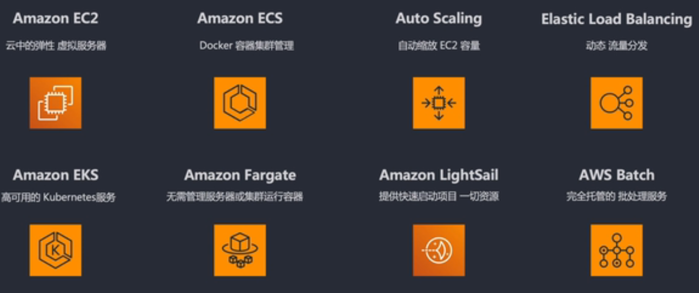

# AWS

## 1. S3 - Simple Storage Service
创建bucket，向bucket里传输静态文件。

## 2. EC2 - Elastic Cloud Compute
创建服务器的实例instance

## 3. ELB, Cloud Watch， Auto Scaling - 弹性收缩三剑客

## 4. Kinesis托管服务 - 不用关心底层服务器

## 5. ECS EC2 Container Service

## 6. EKS EC2 Kubenetes Service

